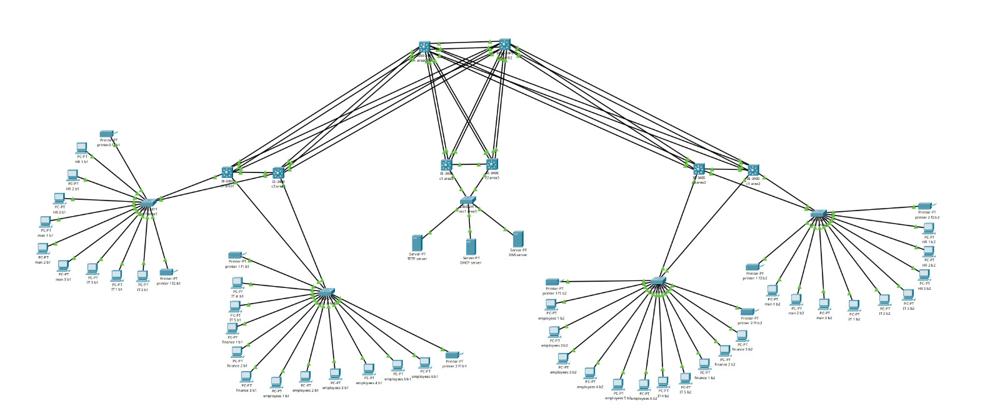

```markdown
# 🏢 Enterprise Network Simulation (CCNA Level Project)

## 📝 Project Description
This is a full-scale enterprise network designed and implemented using **Cisco Packet Tracer**. The project serves as a comprehensive hands-on lab covering advanced CCNA-level networking concepts, focusing on high availability, scalability, and modular design.

Built over 3 days, this simulation reflects a real corporate environment with multiple branches and a centralized data center.

---

## 📌 Technical Summary
The network is built on a hierarchical model (Core, Distribution, Access) to ensure stability and ease of management.

- 🔹 **Routing:** Multi-Area OSPF (4 Areas) for efficient route propagation.
- 🔹 **Redundancy:** HSRP for gateway failover and EtherChannel for link redundancy.
- 🔹 **Switching:** VLANs, Rapid PVST+, and L3 EtherChannels.
- 🔹 **Services:** Centralized DHCP Relay, DNS resolution, and TFTP backup.

---

## 🗺️ Network Topology

<p align="center">
  
</p>

*Figure 1: Complete Physical and Logical Topology Map.*

---

## 📁 Repository Structure
| File Name | Description |
| :--- | :--- |
| `Hasan_Elfanhry_Enterprise_Network...pdf` | **Full Technical Documentation** (Configs & Verification) |
| `Enterprise-Network-Simulationpkt.pkt` | Cisco Packet Tracer Source Lab File |
| `Enterprise-Network-Topology.jpg` | High-Resolution Topology Diagram |

---

## 🔷 Detailed Network Implementation

### 🌐 1. OSPF Multi-Area Design
To reduce SPF calculations and routing table size, the network is divided into:
* **Area 0 (Backbone):** Connects the Core L3 Switches.
* **Area 1 (Building 1):** Handles all departments in the first branch.
* **Area 2 (Building 2):** Handles all departments in the second branch.
* **Area 3 (Server Farm):** Isolated area for critical enterprise services.

### 🔁 2. Gateway Redundancy (HSRP)
We used HSRP to provide an invisible gateway for end-users. If one Core switch fails, the other takes over instantly.

```markdown
! Configuration Example for VLAN 10
interface Vlan10
 ip address 192.168.10.2 255.255.255.0
 ip helper-address 10.10.100.10
 standby 10 ip 192.168.10.1
 standby 10 priority 110
 standby 10 preempt

```
### 🏢 3. VLAN & Subnetting Table
| VLAN | Department | Subnet | Role |
|---|---|---|---|
| 10 | HR | 192.168.10.0/24 | End Users |
| 20 | IT | 192.168.20.0/24 | Admin & Support |
| 30 | Management | 192.168.30.0/24 | Executives |
| 40 | Finance | 192.168.40.0/24 | Secure Dept |
| 99 | Native | 10.99.99.0/24 | Management |
### 🌲 4. Spanning Tree & EtherChannel
 * **Rapid PVST+:** Configured to prevent loops while ensuring fast convergence.
 * **Port-Channels:** Combined multiple 1Gbps links into logical pipes using **LACP**.
## 🔍 Verification & Testing
The following tests were performed (Details in the PDF):
 1. **End-to-End Connectivity:** Ping tests between all VLANs.
 2. **Redundancy Test:** Shutting down a Core link to verify HSRP and OSPF convergence.
 3. **Service Test:** Verifying DHCP IP assignment and DNS name resolution.
## 🚀 Future Roadmap
 * [ ] **Security:** Implementing Standard and Extended ACLs.
 * [ ] **Edge:** Configuring NAT/PAT for simulated Internet access.
 * [ ] **Hardening:** Port Security and DHCP Snooping.
## 🛠️ Built With
 * **Simulator:** Cisco Packet Tracer 8.x
 * **Protocols:** OSPF, HSRP, STP (Rapid PVST+), LACP, Inter-VLAN Routing, DHCP Relay.
**Prepared by: Hasan Elfanhry**
```

**طريقة الاستخدام:**
1. اضغط على أيقونة النسخ فوق هذا الصندوق.
2. روح لصفحة الـ **README.md** على GitHub.
3. امسح كل شي موجود وسوي **Paste**.
4. اضغط **Commit changes** وراح تطلع عندك الصفحة فد شي خرافي!

```
